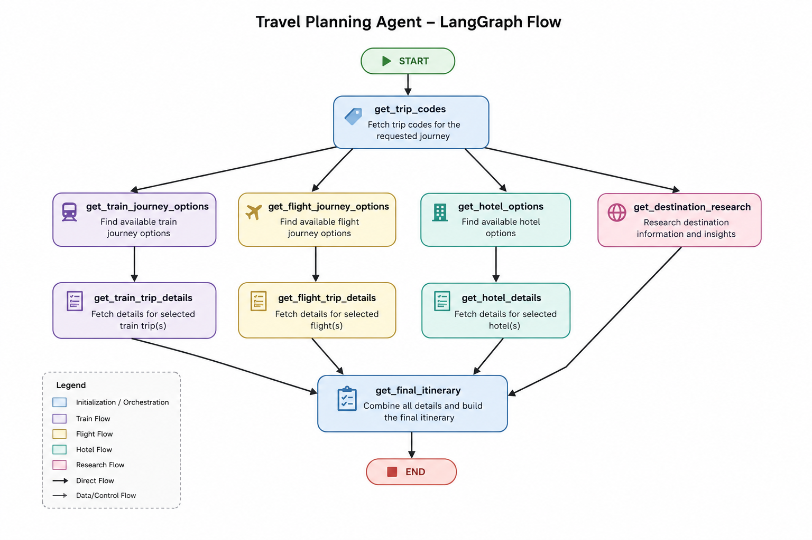

# ✈️ Trip Planner Agent

<div align="center">

[](https://www.python.org/)
[](https://streamlit.io/)
[](https://github.com/langchain-ai/langgraph)
[](https://langchain.com/)
[](https://ai.google.dev/)
[](LICENSE)

An intelligent AI-powered trip planning agent that creates personalized travel itineraries by searching for trains, flights, hotels, and destination insights in real-time.

[Features](#-features) • [Setup](#-setup) • [Usage](#-usage) • [Architecture](#-architecture)

</div>

---

## 🎯 Overview

**Trip Planner Agent** is an advanced travel planning application that uses LangGraph and LLMs to orchestrate a multi-step workflow for creating comprehensive travel itineraries. It intelligently searches for transportation options (trains & flights), accommodations, and destination research to provide personalized travel recommendations.

Whether you're planning a weekend getaway or an extended vacation, this agent handles all the research and planning legwork for you!

---

## ✨ Features

- 🌍 **Multi-Modal Transportation Search**
  - Real-time train availability and pricing
  - Flight options across multiple airlines
  - Intelligent route optimization

- 🏨 **Accommodation Discovery**
  - Hotel search by budget and preferences
  - Location-based recommendations
  - Ratings and reviews integration

- 📚 **Destination Intelligence**
  - Tourist attractions and hidden gems
  - Cultural experiences and local cuisine
  - Adventure activities and seasonal tips
  - Travel guides powered by Tavily search

- 🤖 **AI-Powered Analysis**
  - LLM-driven decision making
  - Personalized recommendations based on preferences
  - Context-aware itinerary generation

- 🎨 **User-Friendly Interface**
  - Interactive Streamlit web application
  - Real-time processing status updates
  - Beautifully formatted travel itineraries

- 📊 **Flexible Travel Planning**
  - Single-way and round-trip options
  - Group travel support (1-10 travelers)
  - Custom preference inputs
  - Date-based searches

---

## 🛠️ Tech Stack

| Component | Technology |
|-----------|-----------|
| **Framework** | [LangGraph](https://github.com/langchain-ai/langgraph) - Orchestration & State Management |
| **LLM** | [Google Generative AI](https://ai.google.dev/) (Gemini 3.1 & 3.5) |
| **LLM Framework** | [LangChain](https://langchain.com/) |
| **Web UI** | [Streamlit](https://streamlit.io/) |
| **Observability** | [LangSmith](https://smith.langchain.com/) - Tracing, Debugging & Analytics |
| **Search API** | [Tavily](https://tavily.com/) - Web Search |
| **API Client** | [SerpAPI](https://serpapi.com/) - Google Search Integration |
| **Web Scraping** | [BeautifulSoup4](https://www.crummy.com/software/BeautifulSoup/) & [Playwright](https://playwright.dev/) |
| **Language** | Python 3.13+ |

---

## 📋 Prerequisites

Before setting up, ensure you have:

- **Python 3.13+** installed ([Download](https://www.python.org/))
- **pip** or **uv** package manager
- **Git** for version control
- API Keys for:
  - 🔑 **Google API Key** - For Generative AI ([Get Key](https://ai.google.dev/))
  - 🔑 **SerpAPI Key** - For flight/hotel search ([Get Key](https://serpapi.com/))
  - 🔑 **Tavily API Key** - For destination research ([Get Key](https://tavily.com/))
  - 🔑 **LangSmith API Key** - For tracing and monitoring ([Get Key](https://smith.langchain.com/))

---

## 🚀 Setup Instructions

### Step 1: Clone the Repository

```bash
git clone https://github.com/yourusername/trip-planner-agent.git
cd trip-planner-agent
```

### Step 2: Create Virtual Environment

```bash
# Using venv
python -m venv .venv

# Activate virtual environment
# On Windows:
.venv\Scripts\activate
# On macOS/Linux:
source .venv/bin/activate
```

### Step 3: Install Dependencies

```bash
# Install from pyproject.toml
pip install -e .

# Or using uv (faster alternative)
uv pip install -e .
```

### Step 4: Create Environment Variables

Create a `.env` file in the project root with your API keys:

```bash
# .env file (DO NOT commit this to version control!)
GOOGLE_API_KEY=your_google_api_key_here
SERP_API_KEY=your_serpapi_key_here
TAVILY_API_KEY=your_tavily_api_key_here

# LangSmith Configuration (for tracing and debugging)
LANGCHAIN_API_KEY=your_langsmith_api_key_here
LANGCHAIN_PROJECT=trip-planner-agent
LANGCHAIN_TRACING_V2=true
LANGCHAIN_ENDPOINT=https://api.smith.langchain.com
```

**⚠️ Security Note:** Add `.env` to your `.gitignore` to prevent accidentally committing sensitive keys:

```bash
echo ".env" >> .gitignore
```

### Step 5: Install Playwright Browsers (for web scraping)

```bash
playwright install
```

---

## 💻 Usage

### Option 1: Interactive Web App (Recommended)

Launch the beautiful Streamlit interface:

```bash
streamlit run streamlit_app.py
```

Then:
1. Open your browser to `http://localhost:8501`
2. Fill in your trip details:
   - Source and destination cities
   - Travel dates
   - Number of travelers
   - Trip type (single-way or round-trip)
   - Your preferences (budget, interests, etc.)
3. Click **"✨ Plan My Trip"** and watch the magic happen!

### Option 2: Direct Python Execution

Run the agent programmatically:

```bash
python main.py
```

The agent will process your trip and save the itinerary to `FINAL_ITINERARY.md`.

#### Example: Programmatic Usage

```python
from main import agent

trip_config = {
    'source': 'Kolkata',
    'destination': 'Goa',
    'need_hotel_stay': True,
    'journey_date': '2026-12-10',
    'return_date': '2026-12-15',
    'trip_mode': 'ROUND_TRIP',
    'total_members': 2,
    'user_preferences': 'Budget-friendly, beach activities, vegetarian food'
}

result = agent.invoke(trip_config)
print(result['final_suggestion'])
```

---

## 🏗️ Project Architecture

```
trip-planner-agent/
├── agents/                          # Agent logic
│   ├── __init__.py
│   └── journey_info_extractor.py   # Trip info extraction agent
├── scrapers/                        # Web scraping modules
│   ├── __init__.py
│   └── rail_info_scraper.py        # Train data scraper
├── utils/                           # Utility functions
│   ├── __init__.py
│   └── data_extractor.py           # Data parsing & extraction
├── prompts/                         # LLM prompts
│   ├── __init__.py
│   └── system_prompts.py           # System prompts for LLMs
├── main.py                          # Core agent orchestration
├── streamlit_app.py                 # Web UI
├── pyproject.toml                   # Project metadata & dependencies
├── README.md                        # This file
└── .env.example                     # Environment variables template
```

### Workflow Graph



---

## 📊 Agent State

The agent manages the following state throughout the journey:

```python
class AgentState(TypedDict):
    source: str                          # Source city
    destination: str                     # Destination city
    journey_date: str                    # Date in YYYY-MM-DD format
    return_date: Optional[str]           # Return date (if round-trip)
    trip_mode: Literal['SINGLE_WAY', 'ROUND_TRIP']
    total_members: int                   # Number of travelers
    need_hotel_stay: bool                # Hotel accommodation needed?
    user_preferences: Optional[str]      # Special requests & preferences
    
    # Station & Airport codes
    src_station_code: Optional[str]
    dest_station_code: Optional[str]
    src_airport_code: Optional[str]
    dest_airport_code: Optional[str]
    
    # Search results
    outward_trains: List[Dict]
    return_trains: List[Dict]
    flights: List[Dict]
    hotels: List[Dict]
    
    # LLM-generated content
    train_trip_details: str
    flight_trip_details: str
    hotel_details: str
    destination_research: str
    final_suggestion: str               # Final itinerary
```

---

## 🔌 API Integrations

### Google Generative AI (Gemini)
- **Model:** Gemini 3.1 Flash (analysis tasks), Gemini 3.5 Flash (final itinerary)
- **Purpose:** LLM-powered analysis and content generation
- **Setup:** [Get API Key](https://ai.google.dev/)

### SerpAPI
- **Purpose:** Real-time flight and hotel search via Google
- **Setup:** [Get API Key](https://serpapi.com/)

### Tavily Search
- **Purpose:** Web research for destination insights
- **Setup:** [Get API Key](https://tavily.com/)

### LangSmith
- **Purpose:** Execution tracing, debugging, and analytics for the agent workflow
- **Features:**
  - 🔍 Real-time trace visualization of agent execution
  - 🐛 Detailed debugging for each node in the graph
  - 📊 Performance metrics and cost tracking
  - 💾 Complete execution history
- **Setup:** [Get API Key](https://smith.langchain.com/)
- **Configuration:** Set `LANGCHAIN_TRACING_V2=true` in `.env` to enable automatic tracing

---

## ⚙️ Configuration

### Customizing LLM Models

Edit [prompts/system_prompts.py](prompts/system_prompts.py) and [main.py](main.py) to change:
- Model versions (Gemini 1.5, 2.0, etc.)
- Temperature and other LLM parameters
- Prompt templates for different trip aspects

### Search Parameters

Modify SerpAPI search parameters in `get_flight_journey_options()` and `get_hotel_options()` functions:
- Currency (default: INR)
- Search depth
- Result limits

---

## 🐛 Troubleshooting

### Issue: "API Key not found"
**Solution:** Verify `.env` file exists in project root with all required keys:
```bash
cat .env  # macOS/Linux
type .env  # Windows
```

### Issue: "Playwright browsers not installed"
**Solution:** Run:
```bash
playwright install
```

### Issue: "Rate limit exceeded"
**Solution:** 
- Wait before making new requests
- Check your API quotas on respective dashboards
- Consider upgrading your API plan

### Issue: "No results found for route"
**Solution:** 
- Verify city names are correct
- Check if routes are serviced
- Try alternative dates
- Ensure dates are in future

### Issue: Streamlit not loading
**Solution:**
```bash
# Clear Streamlit cache and restart
streamlit run streamlit_app.py --logger.level=debug
```

---

## 📈 Performance Tips

- 🚀 **Parallel Processing:** The agent uses LangGraph's parallel node execution
- 💾 **Caching:** LangSmith integration provides execution tracing and caching
- 🔄 **Error Handling:** Graceful fallbacks for API failures
- ⚡ **Streaming:** Real-time progress updates in Streamlit UI

---

## 🤝 Contributing

Contributions are welcome! Please:

1. Fork the repository
2. Create a feature branch (`git checkout -b feature/AmazingFeature`)
3. Commit your changes (`git commit -m 'Add AmazingFeature'`)
4. Push to the branch (`git push origin feature/AmazingFeature`)
5. Open a Pull Request

---

## 📧 Contact

For questions, suggestions, or collaborations, feel free to reach out:

- **Email:** mainakcr72002@gmai.com

## 🎓 Learning Resources

- [LangGraph Documentation](https://langchain-ai.github.io/langgraph/)
- [LangChain Documentation](https://python.langchain.com/)
- [Streamlit Documentation](https://docs.streamlit.io/)
- [Google Generative AI Docs](https://ai.google.dev/docs)
- [Tavily Search API](https://tavily.com/api)

---

<div align="center">

**Made with ❤️ for travelers and wanderers**

⭐ If you find this project helpful, please give it a star!

</div>
